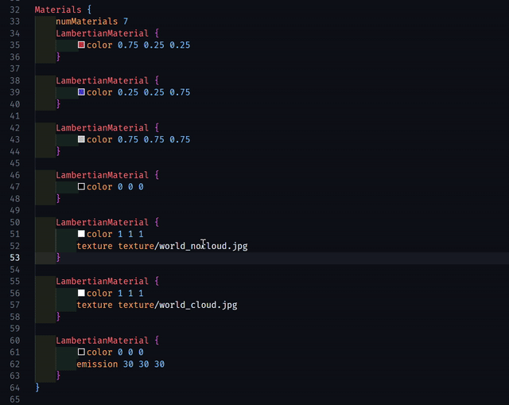

# Scene Language Support


Provides syntax highlighting for `.scene` files used in rendering testcases during the computer graphics course. Note that `.scene` is used simply as an alternative to `.txt` to avoid conflicts with other extensions.

## Features

- Highlights camera, light, material, and geometry descriptions.
- Supports basic format operations.
- Auto fix for number of objects, lights, and materials in the scene.
- Hovering over `MaterialIndex` shows the materiFal name.
- Ctrl + clicking on `MaterialIndex` jumps to the material definition.
- Supports GUI editing for colors in `.scene` files, allowing you to click on color values to open a color picker.
- As a small bonus, a preview icon is provided for `.scene` files in the file explorer (or is it?).

## Usage

It is recommended to add the following to your editor `settings.json` to enable file icon association in case the Material Icon Theme does not automatically recognize the `.scene` file extension:

```json
{
  "material-icon-theme.files.associations": {
    "*.scene": "3d"
  }
}
```

## File extension

`.scene`

## Example


